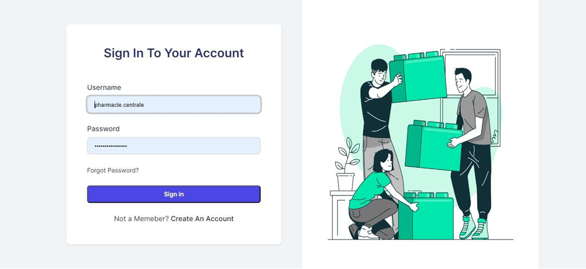
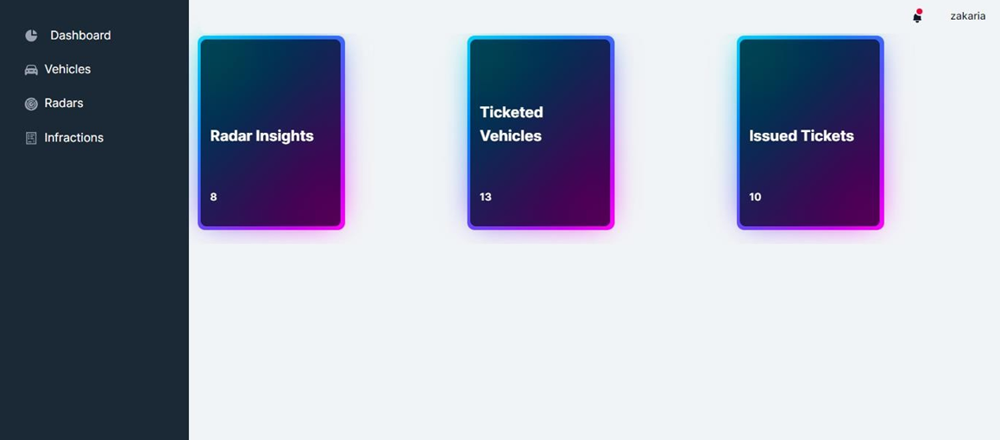
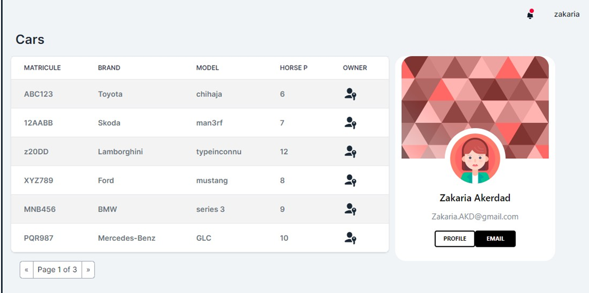
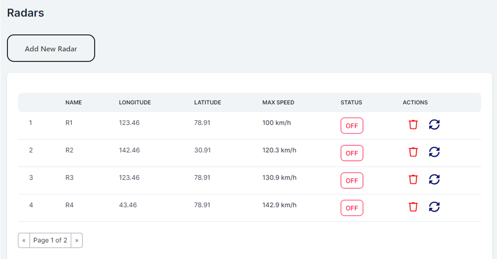

# Infraction-Manager
Distributed System for Automated Traffic Offenses
## Introduction
This project aims to develop a distributed system based on microservices architecture. The system automates the process of handling traffic offenses related to speeding detected by automatic radars. The project consists of three microservices:
### Radar microservice: 
Manages the radar devices, each defined by its ID, maximum speed, and coordinates (longitude and latitude).
### Registration microservice: 
Manages vehicles owned by owners. Each vehicle belongs to a single owner. An owner is defined by their ID, name, date of birth, email, and address. A vehicle is defined by its ID, license plate number, brand, fiscal horsepower, and model.
### Offense microservice:
Manages traffic offenses. Each offense is defined by its ID, date, radar number that detected the speeding, vehicle license plate number, vehicle speed, radar maximum speed, and offense amount.

In addition to the typical CRUD operations for data consultation and modification, the system allows posting a speeding violation that results in an offense. Furthermore, it enables owners to view their offenses.

## Project Tasks
The project tasks involve the following:
1. Establishing the technical architecture of the project.
2. Creating a global class diagram for the project.
3. Developing the Registration microservice:
      * Implementing JPA entities and JpaRepository interface using Spring Data.
      * Creating four web services: REST, GraphQL, SOAP, and gRPC.
      * Testing the four web services.
4. Developing the Offense microservice.
5. Developing the Radar microservice:
      * For each speeding violation, this service should consult the Registration service to retrieve vehicle owner information.
      * Then, it should invoke the Offense service to generate a new offense.
      * The communication between services can be implemented using REST, SOAP, gRPC, or GraphQL.
6. Creating a Java application that simulates a radar device randomly generating speeding violations and sending them, via gRPC, to the Radar microservice.
7. Implementing the technical services of the microservices architecture (Gateway, Eureka Discovery service).
8. Developing the frontend application using Angular.
## Technologies Used

### Backend Technologies
The backend of this project utilizes the following technologies:
* Java: Programming language used for developing the microservices and backend functionality.
* Spring Boot: Framework for creating microservices and managing dependencies.
* JPA (Java Persistence API): Standard API for accessing and managing relational databases.
* RESTful APIs: Architectural style for building web services.
* GraphQL: A query language for APIs and runtime for executing queries.
* SOAP: Protocol for exchanging structured information in web services.
* gRPC: A high-performance, open-source framework for remote procedure calls.
#### Eureka Discovery Project Structure:
````
├───.idea
├───.mvn
│   └───wrapper
├───src
│   ├───main
│   │   ├───java
│   │   │   └───com
│   │   │       └───example
│   │   │           └───eurekadiscoveryserver
│   │   └───resources
│   └───test
│       └───java
│           └───com
│               └───example
│                   └───eurekadiscoveryserver
└───target
    ├───classes
    │   └───com
    │       └───example
    │           └───eurekadiscoveryserver
    └───generated-sources
        └───annotations
````

#### Gateway Project Structure
````
├───.idea
├───.mvn
│   └───wrapper
├───src
│   ├───main
│   │   ├───java
│   │   │   └───com
│   │   │       └───example
│   │   │           └───gatewayprojet
│   │   └───resources
│   └───test
│       └───java
│           └───com
│               └───example
│                   └───gatewayprojet
└───target
    ├───classes
    │   └───com
    │       └───example
    │           └───gatewayprojet
    └───generated-sources
        └───annotations
````

#### Immatriculation Micro-Service Structure:
````
├───main
│   ├───java
│   │   └───com
│   │       └───example
│   │           └───immatriculationservice
│   │               ├───dto
│   │               ├───entities
│   │               ├───grpc
│   │               │   ├───services
│   │               │   └───stubs
│   │               ├───mapper
│   │               ├───repositories
│   │               ├───service
│   │               └───web
│   │                   ├───graphqlController
│   │                   ├───restController
│   │                   └───soapController
│   └───resources
│       ├───graphql
│       ├───static
│       └───templates
└───test
    └───java
        └───com
            └───example
                └───immatriculationservice
````

#### Radars Micro-Service Structure:
````
├───main
│   ├───java
│   │   └───com
│   │       └───example
│   │           └───radarservice
│   │               ├───entities
│   │               ├───feignClients
│   │               ├───models
│   │               ├───repositories
│   │               └───web
│   └───resources
│       ├───static
│       └───templates
└───test
    └───java
        └───com
            └───example
                └───radarservice
````

#### Infractions Micro-Service Structure
````
├───main
│   ├───java
│   │   └───com
│   │       └───example
│   │           └───infractionservices
│   │               ├───entities
│   │               ├───repositories
│   │               └───web
│   └───resources
│       ├───graphql
│       ├───static
│       └───templates
└───test
    └───java
        └───com
            └───example
                └───infractionservices
````
  
### Frontend Technologies
The frontend of this project is developed using the following technologies:

* Angular: JavaScript frameworks for building user interfaces.
* HTML: A markup language for creating web pages.
* CSS: Stylesheet language for designing the appearance of web pages.
* TypeScript: A programming language for implementing dynamic functionality on the front end.
* Bootstrap: CSS framework for responsive and mobile-first web development.
* RESTful APIs: Used to communicate with the backend services and retrieve data.
Here are some screenshots of the front end:
Login:
Dashboard:
Vehicles:
Radars:
For more details, check out this short video:


## License
This project is licensed under the MIT License. Feel free to use, modify, and distribute it according to the terms of the license.
  

